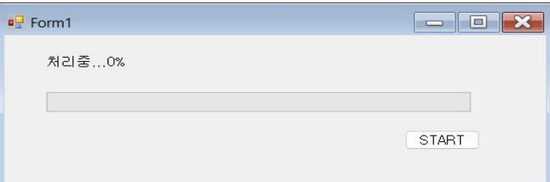
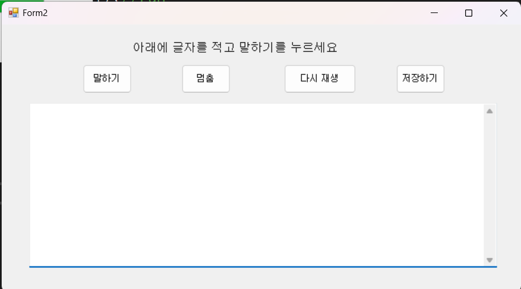
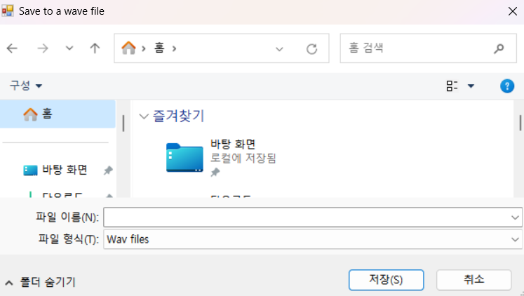

# csharp_PJ

#### 디렉토리:Click [here](https://github.com/Seo-001/FED-REAL-PJ-SHW.git)

#### README:Click [here](https://seo-001.github.io/FED-REAL-PJ-SHW/)

 

---

## c# 프로젝트 

### 링크

#### 디렉토리:Click [here](https://github.com/Seo-001/FED-REAL-PJ-SHW/blob/main/01.%EA%B0%9C%EC%9D%B8%ED%94%84%EB%A1%9C%EC%A0%9D%ED%8A%B8_%EC%84%9C%ED%95%B4%EC%9B%90/index.html)

#### ppt: Click [here](https://seo-001.github.io/FED-REAL-PJ-SHW/01.%EA%B0%9C%EC%9D%B8%ED%94%84%EB%A1%9C%EC%A0%9D%ED%8A%B8_ppt/%EA%B0%80%EC%9D%B4%EB%93%9C%20%EB%AC%B8%EC%84%9C_%EC%84%9C%ED%95%B4%EC%9B%90.pdf)

### 설명 :

#### 1) 로딩시 프로그래스바 설정

#### 2) SPA (Single Page Application) 구성하기 위함

#### 3) 새창 띄우기 

#### 4) 글을 말소리로 옮기기 

 
